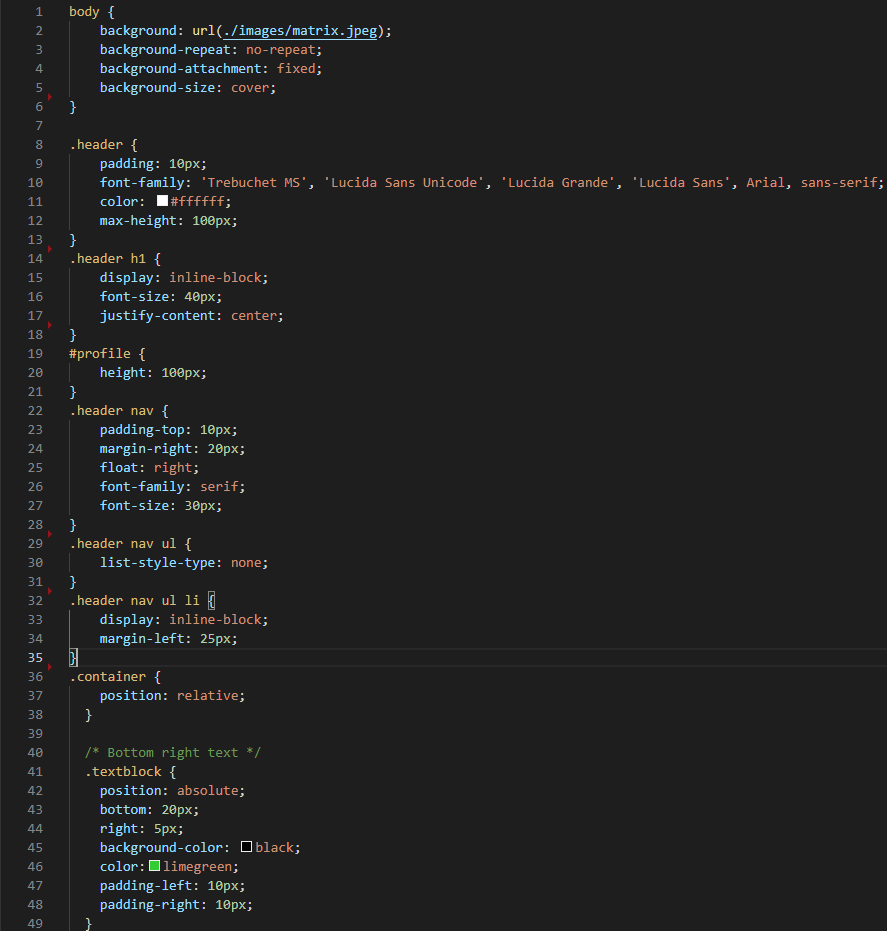

# **PERSONAL PORTFOLIO**

## **Description**

A portfolio of work to showcase my skills and talents to potential employers.

## **Table Of Contents**

1. Links to deployed application and Github repository (public).
2. User Story
3. Acceptance Criteria
4. Website Screenshot
5. HTML Screenshot
6. CSS Screenshot
7. Credits


## **Links**

 #### View Deployed application @ https://davidlemerle.github.io/Beginner-Portfolio/
 #### Project repository @ https://github.com/davidlemerle/Beginner-Portfolio


## **User Story**

```
AS AN employer
I WANT to view a potential employee's deployed portfolio of work samples
SO THAT I can review samples of their work and assess whether they're a good candidate for an open position
```


## **Acceptance Criteria**

Here are the critical requirements necessary to develop a portfolio that satisfies a typical hiring manager’s needs:

```
GIVEN I need to sample a potential employee's previous work
WHEN I load their portfolio
THEN I am presented with the developer's name, a recent photo or avatar, and links to sections about them, their work, and how to contact them
WHEN I click one of the links in the navigation
THEN the UI scrolls to the corresponding section
WHEN I click on the link to the section about their work
THEN the UI scrolls to a section with titled images of the developer's applications
WHEN I am presented with the developer's first application
THEN that application's image should be larger in size than the others
WHEN I click on the images of the applications
THEN I am taken to that deployed application
WHEN I resize the page or view the site on various screens and devices
THEN I am presented with a responsive layout that adapts to my viewport
```

# **Website Screenshot**


## **HTML Screenshot**


## **CSS Screenshot**


## **Credits**

#### Coding Bootcamp University Of Birmingham
#### Ahmed Meedaxa (Bootcamp Assigned Tutor)

